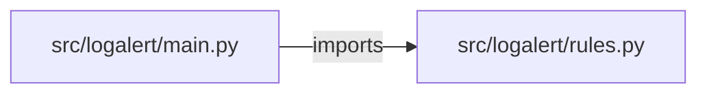

# log-analyzer-alerting — project architecture

[README](README.md) · [Interview questions and answers](INTERVIEW_QA.md)

## Purpose and scope

Paste a log. Rules match lines, matches are grouped by rule, and a group fires only when it reaches its threshold.

This document describes files and symbols in this checkout. Deployment templates and statements in the original overview are distinguished from a verified running environment.

## Component diagram



For Python repositories, arrows show resolved local imports, not network calls or deployment order. Otherwise the diagram is a repository component map; containment arrows do not assert runtime integration.

## Components and responsibilities

| Component | Responsibility |
| --- | --- |
| [`src/logalert/main.py`](src/logalert/main.py) | HTTP handlers: `GET /healthz`, `GET /rules`, `POST /logs/analyze` |
| [`src/logalert/rules.py`](src/logalert/rules.py) | Functions: `redact`, `compile_rules`, `analyze` |
| [`requirements.txt`](requirements.txt) | Implementation or supporting configuration |
| [`tests/test_rules.py`](tests/test_rules.py) | Executable checks and regression examples |
| [`.github/workflows/ci.yml`](.github/workflows/ci.yml) | GitHub Actions job definitions |
| [`README.md`](README.md) | Project explanations or operating notes |

## Request interface

| Method and path | Handler | Source |
| --- | --- | --- |
| `GET /healthz` | `healthz` | [`src/logalert/main.py`](src/logalert/main.py#L25) |
| `GET /rules` | `list_rules` | [`src/logalert/main.py`](src/logalert/main.py#L30) |
| `POST /logs/analyze` | `analyze_logs` | [`src/logalert/main.py`](src/logalert/main.py#L40) |

The table lists literal route decorators found in the inspected Python modules. Router prefixes and middleware can add behavior; check the linked handler and application setup before calling an endpoint.

## Implementation walkthrough

### `analyze(text, rules=DEFAULT_RULES, min_severity='low')`

Source: [`src/logalert/rules.py`](src/logalert/rules.py#L65).

Calls visible in this function: `RuleError`, `SEVERITIES.index`, `alerts.append`, `enumerate`, `groups.setdefault`, `groups.values`, `len`, `line.strip`, `matches.append`, `redact`, `rule.pattern.search`, `sorted`.

```python
def analyze(text, rules=DEFAULT_RULES, min_severity="low"):
    lines = text.splitlines()
    if len(lines) > MAX_LINES:
        raise RuleError(f"log has {len(lines)} lines; the limit is {MAX_LINES}")
    floor = SEVERITIES.index(min_severity)
    matches = []
    for number, line in enumerate(lines, start=1):
        for rule in rules:
            if SEVERITIES.index(rule.severity) < floor:
                continue
            if rule.pattern.search(line):
                matches.append({"line": number, "rule": rule.name, "severity": rule.severity, "text": redact(line.strip())})
    groups = {}
    for match in matches:
        group = groups.setdefault(match["rule"], {"rule": match["rule"], "severity": match["severity"], "count": 0, "first_line": match["line"]})
        group["count"] += 1
    thresholds = {rule.name: rule.threshold for rule in rules}
    alerts = []
    for group in groups.values():
        group["threshold"] = thresholds[group["rule"]]
        group["firing"] = group["count"] >= group["threshold"]
        if group["firing"]:
```

The excerpt is truncated; the linked source contains the full implementation.

### `compile_rules(custom)`

Source: [`src/logalert/rules.py`](src/logalert/rules.py#L42).

Calls visible in this function: `', '.join`, `Rule`, `RuleError`, `int`, `item.get`, `len`, `re.compile`, `rules.append`, `str`, `str(item.get('name', '')).strip`, `tuple`.

```python
def compile_rules(custom):
    rules = []
    for item in custom:
        name = str(item.get("name", "")).strip()
        source = str(item.get("pattern", ""))
        severity = item.get("severity", "medium")
        threshold = int(item.get("threshold", 1))
        if not name:
            raise RuleError("a rule needs a name")
        if not source or len(source) > MAX_PATTERN:
            raise RuleError(f"rule {name} pattern must be 1 to {MAX_PATTERN} characters")
        if severity not in SEVERITIES:
            raise RuleError(f"rule {name} severity must be one of {', '.join(SEVERITIES)}")
        if threshold < 1:
            raise RuleError(f"rule {name} threshold must be at least 1")
        try:
            pattern = re.compile(source)
        except re.error as exc:
            raise RuleError(f"rule {name} pattern does not compile: {exc}") from exc
        rules.append(Rule(name, pattern, severity, threshold))
    return tuple(rules)
```

### `redact(line)`

Source: [`src/logalert/rules.py`](src/logalert/rules.py#L36).

Calls visible in this function: `match.group`, `match.group(0).split`, `pattern.sub`.

```python
def redact(line):
    for pattern in SECRETS:
        line = pattern.sub(lambda match: match.group(0).split("=")[0] + "=[redacted]" if "=" in match.group(0) else "[redacted]", line)
    return line
```

## Validation and failure paths

| Explicit exception | Source |
| --- | --- |
| `HTTPException(status_code=422, detail=str(exc))` | [`src/logalert/main.py`](src/logalert/main.py#L45) |
| `RuleError(f'log has {len(lines)} lines; the limit is {MAX_LINES}')` | [`src/logalert/rules.py`](src/logalert/rules.py#L68) |
| `RuleError('a rule needs a name')` | [`src/logalert/rules.py`](src/logalert/rules.py#L50) |
| `RuleError(f'rule {name} pattern must be 1 to {MAX_PATTERN} characters')` | [`src/logalert/rules.py`](src/logalert/rules.py#L52) |
| `RuleError(f"rule {name} severity must be one of {', '.join(SEVERITIES)}")` | [`src/logalert/rules.py`](src/logalert/rules.py#L54) |
| `RuleError(f'rule {name} threshold must be at least 1')` | [`src/logalert/rules.py`](src/logalert/rules.py#L56) |
| `RuleError(f'rule {name} pattern does not compile: {exc}')` | [`src/logalert/rules.py`](src/logalert/rules.py#L60) |

These are explicit exceptions in the inspected source, rather than a claim that every failure is handled. Follow the calling handler to see whether the exception becomes an HTTP response or propagates.

## Data flow and design decisions

### What is the input-to-output contract of `analyze`

In [`src/logalert/rules.py`](src/logalert/rules.py#L65), `analyze(text, rules=DEFAULT_RULES, min_severity='low')` receives the inputs. The function computes these intermediate values:

- `lines = text.splitlines()`
- `floor = SEVERITIES.index(min_severity)`
- `matches = []`
- `groups = {}`
- `thresholds = {rule.name: rule.threshold for rule in rules}`
- `alerts = []`
- `ordered = sorted(groups.values(), key=lambda group: (-SEVERITIES.index(group['severity']), group['first_line']))`

Its result is defined by:

- `{'lines': len(lines), 'matches': matches, 'count': len(matches), 'groups': ordered, 'firing': alerts, 'paged': False}`

### Which decision rules or boundary conditions should an interviewer challenge

The implementation in [`src/logalert/rules.py`](src/logalert/rules.py#L65) branches on:

- `len(lines) > MAX_LINES`
- `group['firing']`
- `SEVERITIES.index(rule.severity) < floor`
- `rule.pattern.search(line)`

A useful extension is a table-driven test that covers each condition just below, at, and above its boundary where applicable. These expressions are the current rules; changing them changes behavior and should be justified by the project’s acceptance criteria.

## Setup and verification

The following commands are derived from the checked-in dependency/test contracts. Execute them from the repository root; the block prepares a local environment, not a cloud deployment.

```bash
python3 -m venv .venv
source .venv/bin/activate
python -m pip install -r requirements.txt
python -m pytest -q
```

Python dependencies: [`requirements.txt`](requirements.txt).

Test entry points: [`tests/test_rules.py`](tests/test_rules.py).

Automation definitions: [`.github/workflows/ci.yml`](.github/workflows/ci.yml). Read their triggers and job steps to determine what CI actually runs.

## Operating boundaries and design review

Before turning this checkout into a customer deployment, establish the input contract, data ownership, access controls, failure response, evaluation criteria, and rollback owner. Repository fixtures and unit tests demonstrate local behavior; they do not establish throughput, uptime, compliance, or business impact.

A useful architecture review starts with the linked implementation: identify where input enters, where a decision is made, which state can change, and which external dependency can fail. Add a deployment view only for infrastructure that is actually configured and exercised.
